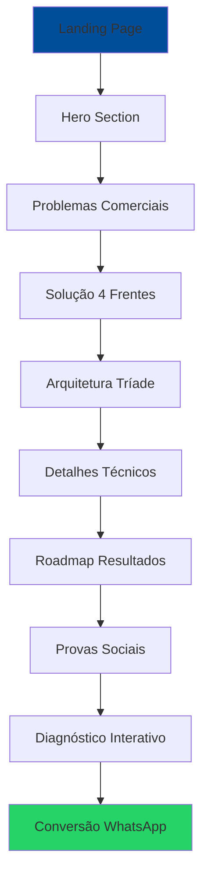

## 1. Visão Geral do Produto

Landing page profissional para serviço de IA Comercial Estratégica que auxilia empresas a identificar gaps comerciais, prever vendas e otimizar desempenho territorial. A página deve transmitir confiança técnica e gerar conversões através de uma experiência interativa e narrativa clara sobre os benefícios da IA no processo comercial.

**Problema:** Empresas perdem oportunidades de vendas devido à falta de visibilidade sobre territórios sem vendas, ausência de previsibilidade e foco comercial ineficiente.

**Solução:** Landing page que demonstra como IA pode transformar dados comerciais em insights acionáveis, com diagnóstico personalizado e consultoria especializada.

**Valor:** Experiência única que educa o mercado sobre IA comercial e converte visitantes em leads qualificados através de demonstrações interativas e diagnóstico personalizado.

## 2. Funcionalidades Principais

### 2.1 Públicos-Alvo
| Público | Método de Aquisição | Principais Necessidades |
|---------|-------------------|------------------------|
| Diretores Comerciais | LinkedIn/Referências | Visibilidade de gaps territoriais e previsibilidade de vendas |
| Gerentes de Vendas | Busca orgânica/PPC | Ferramentas para priorizar esforço comercial e identificar oportunidades |
| Analistas Comerciais | Conteúdo educativo | Soluções técnicas para análise de dados e predição de comportamentos |

### 2.2 Módulos da Landing Page
Nossa landing page será composta pelas seguintes seções principais:

1. **Hero Section**: Apresentação impactante com valor proposition claro e CTAs principais
2. **Seção de Problemas**: Cards interativos destacando principais dores do mercado
3. **Solução 4 Frentes**: Demonstração visual das capacidades de IA (Descritiva, Diagnóstica, Preditiva, Prescritiva)
4. **Arquitetura Tríade**: Explicação interativa sobre integração de GIS + ML + IA Generativa
5. **Detalhamento Técnico**: Informações técnicas sobre modelos de IA com navegação contextual
6. **Roadmap de Implementação**: Timeline visual de entregas e resultados esperados
7. **Provas Sociais**: Exemplos reais de insights gerados pela IA
8. **Diagnóstico Interativo**: Questionário inteligente para qualificação de leads
9. **CTA Final**: Seção de conversão com contato direto via WhatsApp

### 2.3 Detalhamento das Páginas
| Nome da Página | Módulo | Descrição das Funcionalidades |
|----------------|---------|--------------------------------|
| Landing Page Principal | Hero Section | Título impactante, subtítulo com valor proposition, botão WhatsApp flutuante, botão para diagnóstico rápido, animações suaves ao scroll |
| Landing Page Principal | Seção Problemas | Cards em grid responsivo com hover effects, ícones representativos, textos concisos sobre dores comerciais |
| Landing Page Principal | Solução 4 Frentes | Grid visual com 4 cards interativos, ícones e descrições para cada tipo de inteligência, transições suaves |
| Landing Page Principal | Arquitetura Tríade | Layout numérico (1-2-3) mostrando integração de camadas, links contextuais para detalhes técnicos, animações de scroll |
| Landing Page Principal | Detalhamento Técnico | Seções expansíveis para cada modelo de IA, navegação contextual com botões de retorno, conteúdo técnico acessível |
| Landing Page Principal | Roadmap Implementação | Tabela visual com fases cronológicas, destaque para resultados imediatos, design que mostra progressão clara |
| Landing Page Principal | Provas Sociais | Blockquotes estilizados com exemplos de insights reais, design que destaca impacto dos dados |
| Landing Page Principal | Diagnóstico Interativo | Modal com formulário inteligente, validação de campos, geração personalizada de recomendações, integração com WhatsApp |
| Landing Page Principal | WhatsApp Flutuante | Botão fixo em posição estratégica, ícone reconhecível, link pré-preenchido com mensagem personalizada |

## 3. Fluxo Principal do Usuário

**Fluxo do Visitante:**
1. Usuário chega via busca orgânica, anúncio ou indicação
2. Visualiza Hero Section com proposition de valor clara
3. Identifica-se com problemas apresentados na seção de dores
4. Explora soluções de IA nas 4 frentes de inteligência
5. Compreende arquitetura técnica através da tríade interativa
6. Visualiza roadmap e resultados esperados
7. Lê exemplos reais de insights gerados
8. Realiza diagnóstico interativo para obter recomendação personalizada
9. Converte através de contato WhatsApp com mensagem pré-formatada

## 4. Design de Interface

### 4.1 Estilo Visual
- **Cores Primárias:** Azul profissional (#004d99) transmitindo confiança e tecnologia
- **Cores Secundárias:** Branco para limpeza, cinzas para textos secundários
- **Botões:** Estilo moderno com bordas arredondadas, hover effects suaves
- **Tipografia:** Roboto (Google Fonts) com variações de peso (300, 400, 700, 900)
- **Layout:** Card-based design com grid responsivo
- **Ícones:** Emojis e ícones minimalistas para melhor compreensão
- **Animações:** Scroll reveal suave, transições CSS para interações

### 4.2 Elementos por Seção
| Página/Seção | Módulo | Elementos de UI |
|--------------|---------|-----------------|
| Hero Section | Principal | Título em fonte grande (900), subtítulo legível, CTA primário em verde WhatsApp, CTA secundário para diagnóstico, fundo com gradiente sutil |
| Problemas | Cards | Grid 3 colunas desktop/1 mobile, cards com sombra sutil, ícones temáticos, textos concisos com quebra de linha estratégica |
| Solução 4 Frentes | Grid | Layout 2x2 desktop/1x4 mobile, ícones grandes, títulos destacados, descrições breves, espaçamento generoso |
| Arquitetura Tríade | Numérica | Números circulares grandes, títulos hierárquicos, descrições técnicas simplificadas, links contextuais destacados |
| Detalhamento Técnico | Expansível | Seções com padding generoso, botões de navegação claros, linguagem técnica acessível, exemplos práticos |
| Roadmap | Timeline | Tabela visual com linhas alternadas, destaque de fases, cores que indicam progressão, textos de resultado em negrito |
| Diagnóstico | Modal | Overlay escuro, formulário clean, radio buttons agrupados logicamente, botão submit destacado, resultado personalizado |

### 4.3 Responsividade
- **Desktop-first:** Otimizado para telas grandes (1920px) com conteúdo centralizado
- **Mobile-adaptive:** Breakpoints em 768px e 480px para tablets e smartphones
- **Touch optimization:** Botões com área de toque mínima de 44px, espaçamento adequado
- **Performance:** Imagens otimizadas, lazy loading, CSS minificado
- **Acessibilidade:** Skip links, contraste adequado, labels para formulários

### 4.4 Interatividade e Animações
- **Scroll Reveal:** Elementos aparecem suavemente ao scrollar com delay progressivo
- **Hover Effects:** Cards e botões respondem com transições suaves
- **Modal Diagnóstico:** Abertura/fechamento animada, foco gerenciado
- **Navegação Contextual:** Links que levam a seções específicas com animação smooth scroll
- **WhatsApp Integration:** Botão flutuante com animação sutil para chamar atenção