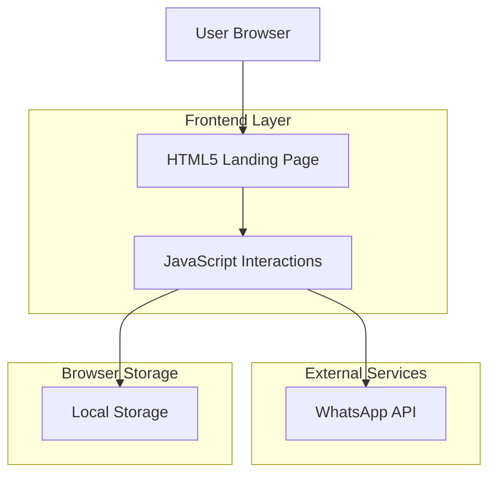
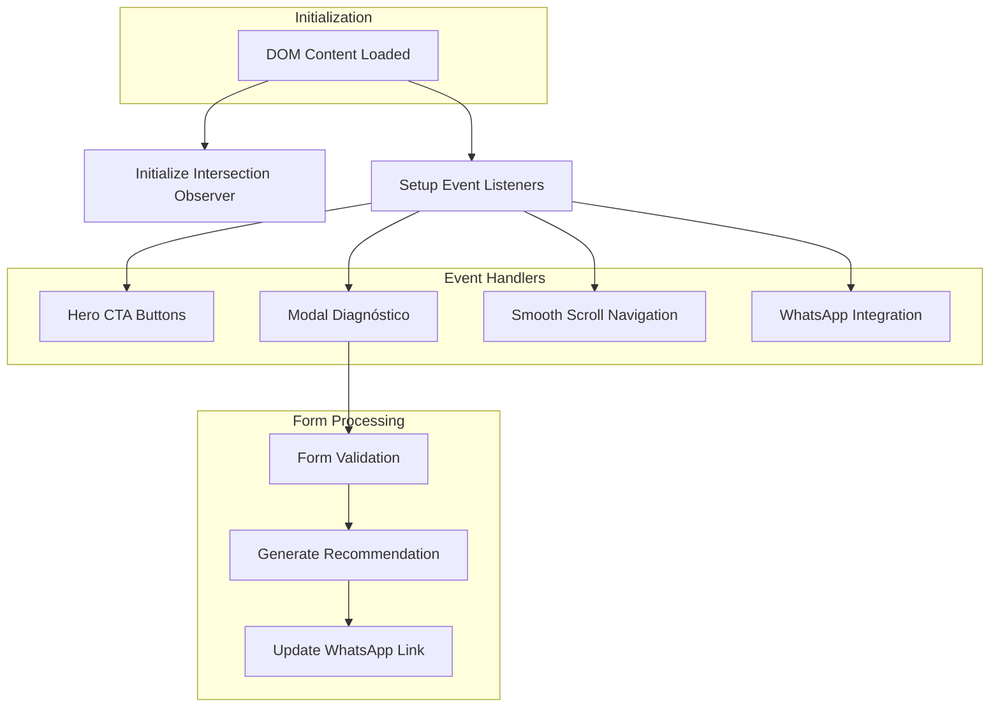

# Arquitetura técnica — Land ONE NorthKeep

Host de marketing: `conheca.one.northkeep.com.br`. App: `one.northkeep.com.br`. KPI: `kpi.northkeep.com.br`. Publicação principal: GitHub Pages (`nk-northkeep/nk-land-one`).

## 1. Arquitetura do Sistema



## 2. Stack Tecnológica

- **Frontend:** HTML5 + CSS3 + JavaScript ES6+
- **Estilização:** CSS Custom Properties + Flexbox/Grid
- **Animações:** CSS Transitions + Intersection Observer API
- **Formulários:** HTML5 Validation + JavaScript Custom Validation
- **Integração:** WhatsApp Business API (via URL scheme)
- **Performance:** Lazy Loading + Resource Hints
- **Versionamento:** Git + Deploy via Nginx

## 3. Definições de Rotas

| Rota | Propósito | Tipo |
|------|-----------|------|
| /index.html | Landing page principal | Estática |
| /style.css | Estilos globais e responsivos | Estática |
| /script.js | Interatividade e lógica | Estática |
| /whatsapp-icon.png | Ícone flutuante WhatsApp | Estática |
| /whatsapp-icon-white.png | Ícone nos CTAs | Estática |
| /favicon.ico | Favicon da aplicação | Estática |

## 4. APIs e Integrações

### 4.1 WhatsApp Business Integration
```
https://wa.me/554731500001?text=[mensagem pré-formatada]
```

**Parâmetros:**
- Telefone: 554731500001 (NorthKeep)
- Mensagem: Pré-preenchida com base no contexto

**Mensagens pré-definidas:**
- Hero CTA: "Olá, quero solicitar uma conversa sobre o ONE."
- Diagnóstico Resultado: Personalizada baseada nas respostas do formulário

### 4.2 Esquema de Dados do Diagnóstico
```javascript
const diagnosticoData = {
    dor: string, // 'territorios_sem_venda' | 'baixa_previsibilidade' | 'foco_ineficiente' | 'risco_churn'
    dados: string, // 'sap' | 'outro_erp' | 'manual'
    objetivo: string, // 'mapear_oportunidades' | 'prever_riscos' | 'recomendacoes'
    timestamp: number, // Unix timestamp
    userAgent: string // Para análise de dispositivo
}
```

### 4.3 Sistema de Recomendações
**Lógica de recomendação baseada em combinações:**

| Dor | Dados | Objetivo | Recomendação Gerada |
|-----|-------|----------|---------------------|
| territorios_sem_venda | sap | mapear_oportunidades | Comece pelo mapa territorial e pela carteira no ONE (já no ar). |
| baixa_previsibilidade | outro_erp | prever_riscos | Use a preditiva já disponível: previsão, churn e anomalias. |
| foco_ineficiente | sap | recomendacoes | Ative a prescritiva; quando virar execução, o plano segue no KPI System. |
| risco_churn | manual | mapear_oportunidades | Organize o recorte mínimo (faturamento, clientes, produtos, metas) e entre pela carteira. |

## 5. Arquitetura do Frontend



## 6. Modelo de Dados e Estado

### 6.1 Estado da Aplicação
```javascript
const appState = {
    modalOpen: boolean,
    diagnostico: {
        step: number,
        responses: object,
        recommendation: string
    },
    scrollPosition: number,
    revealedSections: array
}
```

### 6.2 Local Storage Schema
```javascript
// Armazena último diagnóstico para remarketing
const userData = {
    lastDiagnostico: diagnosticoData,
    visitCount: number,
    firstVisit: timestamp,
    lastVisit: timestamp,
    utmSource: string // Para tracking de campanhas
}
```

### 6.3 Analytics Events
```javascript
// Eventos tracking para análise de conversão
const analyticsEvents = {
    'section_view': { section: string },
    'diagnostico_started': {},
    'diagnostico_completed': { dor: string, dados: string, objetivo: string },
    'whatsapp_click': { source: 'nav' | 'hero' | 'float' | 'diagnostico' | string }
}
```

## 7. Performance e Otimização

### 7.1 Critical Rendering Path
- **CSS Inline:** Estilos críticos inline para primeira renderização
- **Font Preload:** Roboto font preload com `font-display: swap`
- **Image Optimization:** WebP com fallback para PNG
- **Script Defer:** Todos scripts com atributo `defer`

### 7.2 Core Web Vitals Targets
- **LCP (Largest Contentful Paint):** < 2.5s
- **FID (First Input Delay):** < 100ms
- **CLS (Cumulative Layout Shift):** < 0.1

### 7.3 Lazy Loading Strategy
```javascript
// Images lazy loading
const images = document.querySelectorAll('img[loading="lazy"]');
const imageObserver = new IntersectionObserver((entries, observer) => {
    entries.forEach(entry => {
        if (entry.isIntersecting) {
            const img = entry.target;
            img.src = img.dataset.src;
            observer.unobserve(img);
        }
    });
});
```

## 8. Segurança e Validação

### 8.1 Form Validation
```javascript
// Validação customizada do diagnóstico
function validateDiagnosticoForm(formData) {
    const errors = {};
    
    if (!formData.dor) errors.dor = 'Selecione uma dor principal';
    if (!formData.dados) errors.dados = 'Selecione o nível de dados';
    if (!formData.objetivo) errors.objetivo = 'Selecione um objetivo';
    
    // Sanitização básica
    Object.keys(formData).forEach(key => {
        if (typeof formData[key] === 'string') {
            formData[key] = formData[key].trim();
        }
    });
    
    return { isValid: Object.keys(errors).length === 0, errors };
}
```

### 8.2 XSS Prevention
- **Input Sanitization:** Todos os inputs são validados e sanitizados
- **Output Encoding:** Conteúdo dinâmico inserido via textContent, não innerHTML
- **CSP Header:** Content Security Policy configurada no servidor

## 9. Deployment e Hospedagem

### 9.1 GitHub Pages (principal)
- Workflow: `.github/workflows/pages.yml`
- Artifact: `_site/` gerado por `scripts/prepare-pages.py`
- Custom domain: `CNAME` → `conheca.one.northkeep.com.br`
- Cloudflare: CNAME `conheca.one` → `nk-northkeep.github.io` (DNS only)

### 9.2 Configuração Nginx (alternativa)
```nginx
server {
    listen 80;
    server_name conheca.one.northkeep.com.br;
    
    # HTTPS redirect (Cloudflare)
    return 301 https://$server_name$request_uri;
}

server {
    listen 443 ssl http2;
    server_name conheca.one.northkeep.com.br;
    
    # SSL dedicado (wildcard *.northkeep.com.br nao cobre este host)
    ssl_certificate /etc/letsencrypt/live/conheca.one.northkeep.com.br/fullchain.pem;
    ssl_certificate_key /etc/letsencrypt/live/conheca.one.northkeep.com.br/privkey.pem;
    
    root /var/www/nk-land-one;
    index index.html;
    
    # Security headers
    add_header X-Frame-Options "SAMEORIGIN" always;
    add_header X-Content-Type-Options "nosniff" always;
    add_header X-XSS-Protection "1; mode=block" always;
    add_header Content-Security-Policy "default-src 'self'; script-src 'self' 'unsafe-inline'; style-src 'self' 'unsafe-inline' fonts.googleapis.com; font-src 'self' fonts.gstatic.com; img-src 'self' data:; connect-src 'self';" always;
    
    # Cache static assets
    location ~* \.(css|js|png|jpg|jpeg|gif|ico|svg)$ {
        expires 1y;
        add_header Cache-Control "public, immutable";
    }
    
    # Main location
    location / {
        try_files $uri $uri/ /index.html;
    }
}
```

### 9.3 CI/CD Pipeline
```bash
# Deploy script example
git pull origin main
npm run build # Se houver processo de build
nginx -t # Test nginx configuration
systemctl reload nginx # Apply changes
```

## 10. Manutenção e Monitoramento

### 10.1 Error Tracking
```javascript
// Global error handler
window.addEventListener('error', (event) => {
    console.error('Global error:', event.error);
    // Send to monitoring service
    sendErrorToMonitoring({
        message: event.error.message,
        stack: event.error.stack,
        url: window.location.href,
        userAgent: navigator.userAgent
    });
});
```

### 10.2 Performance Monitoring
```javascript
// Performance metrics collection
function collectPerformanceMetrics() {
    const navigation = performance.getEntriesByType('navigation')[0];
    const paint = performance.getEntriesByType('paint');
    
    return {
        domContentLoaded: navigation.domContentLoadedEventEnd - navigation.domContentLoadedEventStart,
        loadComplete: navigation.loadEventEnd - navigation.loadEventStart,
        firstPaint: paint.find(p => p.name === 'first-paint')?.startTime,
        firstContentfulPaint: paint.find(p => p.name === 'first-contentful-paint')?.startTime
    };
}
```